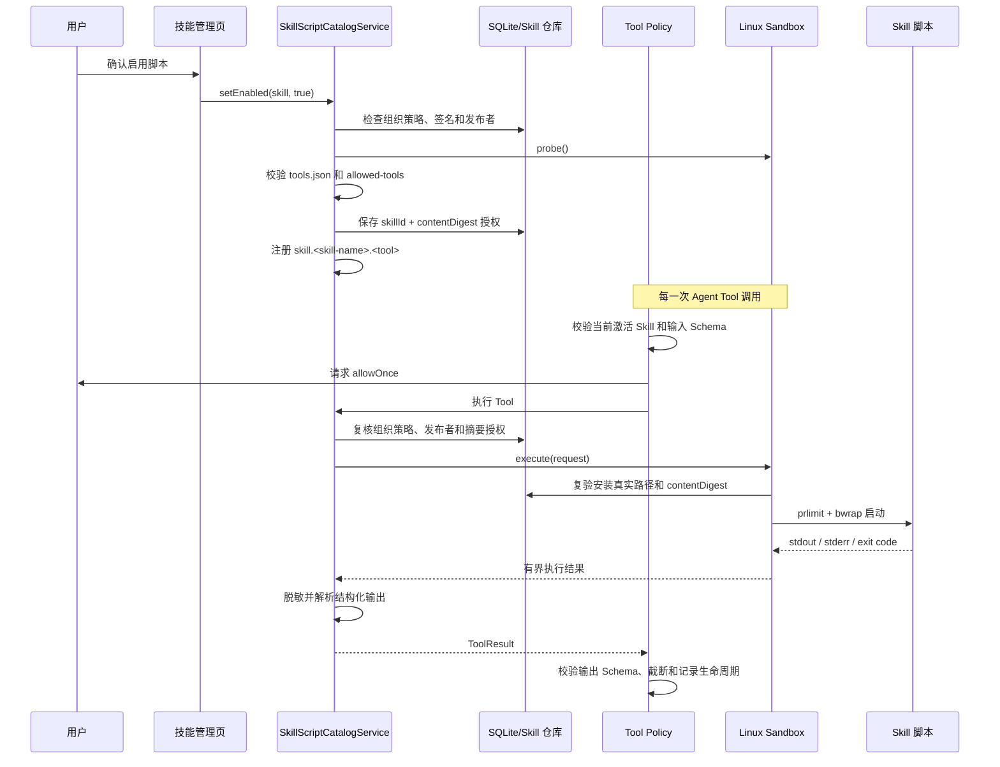

# Skill 脚本沙箱实现

[返回文档导航](../README.md)

本文档描述 Stars 已经落地的桌面 Skill 脚本沙箱。内容以当前代码为准，
重点说明安全边界、启用条件、执行链路、Linux 隔离参数、资源限制、完整性校验、
输入输出协议、合规记录和故障处理。

## 1. 范围与目标

Skill 可以在包内携带 `scripts/tools.json` 和脚本文件，并将脚本声明为 Agent Tool。
脚本属于不可信输入，不能因为 Skill 已安装、已签名或已经出现在 `allowed-tools`
中就直接获得宿主机进程权限。

当前实现采用以下原则：

- 脚本默认不注册，必须由用户对当前 Skill 内容摘要显式启用；
- 注册、Tool 调用和进程启动是三个独立授权点；
- 每次启动前重新验证安装目录及全部受保护内容；
- 脚本进程不继承 Stars 的环境变量、凭据、主目录或普通宿主文件系统；
- 网络、宿主文件读写和外部服务访问不作为脚本能力开放；
- 内核或 helper 无法提供所需隔离时失败关闭；
- 运行时间、CPU、内存、进程数、文件、输出均有上限；
- 脚本输出进入模型前必须经过大小限制、脱敏和可选 Schema 校验；
- Skill 更新后旧授权不延续到新的内容摘要。

当前沙箱仅支持 Linux。Windows、macOS、Android 和 iOS 不注册 Skill Script Tool。

## 2. 安全边界

### 2.1 防护对象

沙箱主要防止 Skill 脚本：

- 读取 Stars 进程环境变量或用户主目录；
- 读取、修改宿主机上的普通文件；
- 访问互联网、局域网或宿主网络服务；
- 通过路径穿越执行 `scripts/` 以外的文件；
- 在用户批准后、实际执行前替换已安装脚本；
- 无限占用 CPU、地址空间、进程、文件描述符、磁盘或输出缓冲；
- 将常见令牌、密码、Cookie 或 API Key 直接写回模型或合规日志；
- 通过更新 Skill 内容复用旧版本的脚本授权。

### 2.2 不在当前防护范围内的事项

当前实现不是虚拟机，也没有声明可以抵御 Linux 内核或 `bubblewrap` 自身的漏洞。
以下能力尚未实现：

- Windows 和 macOS 原生沙箱；
- 独立的 seccomp 系统调用过滤配置；
- 每个 Skill 自定义的解释器、依赖安装或资源上限；
- 网络白名单、宿主目录白名单或持久化脚本工作目录；
- 对脚本源码语义进行静态恶意代码分析；
- 在应用运行期间自动重新探测刚安装或刚修复的 helper。

因此，可信签名、用户批准和操作系统补丁仍然是整体安全模型的一部分。

## 3. 代码组成

| 组件 | 责任 |
| --- | --- |
| `SkillScriptManifestParser` | 解析和约束 `scripts/tools.json` |
| `SkillScriptCatalogService` | 探测沙箱、管理摘要授权、注册和撤销 Tool |
| `SkillScriptTool` | 调用前复核授权、封装执行、脱敏输出、记录脚本事件 |
| `LinuxBubblewrapSkillSandbox` | 使用 `bubblewrap` 和 `prlimit` 创建进程隔离 |
| `SkillPackageStorageService` | 管理不可变安装目录、计算摘要、执行前完整性复验 |
| `DefaultToolPolicy` | 要求脚本属于当前激活 Skill，并对每次调用进行一次性批准 |
| `AgentRunCoordinator` | 校验输入/输出 Schema、处理批准、外层超时和结果截断 |
| `SkillEcosystemRepository` | 持久化组织策略、发布者、摘要授权和合规事件 |

核心接口是：

```dart
abstract interface class SkillScriptSandbox {
  Future<SkillSandboxStatus> probe();

  Future<SkillScriptExecutionResult> execute(
    SkillScriptExecutionRequest request,
    AgentCancellationToken cancellationToken,
  );
}
```

领域层不依赖 Linux。其他平台未来可以实现同一接口，但只有在能提供等价的文件系统、
网络、环境变量和资源隔离时才能返回 `available`。

## 4. 总体执行链路



任何一层拒绝都不会绕过到下一层。脚本在 Tool Registry 中“可见”不代表它可以直接
执行。

## 5. Skill 脚本包约定

### 5.1 文件布局

```text
example-skill/
├── SKILL.md
├── SIGNATURE.json          # 可选，分离式签名
└── scripts/
    ├── tools.json
    └── transform.py
```

`SKILL.md` 必须通过普通 Skill 安装校验。脚本 Tool 的规范名称还必须出现在
`SKILL.md` frontmatter 的 `allowed-tools` 中，例如：

```yaml
---
name: example
description: Example Skill.
allowed-tools:
  - skill.example.transform
---
```

### 5.2 `scripts/tools.json`

```json
{
  "schemaVersion": 1,
  "tools": [
    {
      "name": "transform",
      "title": "Transform",
      "description": "Transform structured input.",
      "entry": "scripts/transform.py",
      "interpreter": "python3",
      "inputSchema": {
        "type": "object",
        "properties": {
          "value": {"type": "string"}
        },
        "required": ["value"]
      },
      "outputSchema": {
        "type": "object"
      },
      "riskLevel": "readOnly",
      "capabilities": ["compute"]
    }
  ]
}
```

当前清单限制如下：

| 项目 | 限制 |
| --- | --- |
| 清单大小 | 最大 128 KB |
| `schemaVersion` | 必须为 `1` |
| Tool 数量 | 最大 32 |
| 本地名称 | `[a-zA-Z0-9_.-]`，长度 1～96 |
| 规范名称 | `skill.<skill-name>.<local-name>`，同一清单内不得重复 |
| 入口 | 必须是 `scripts/` 下的相对路径，文件必须实际存在 |
| 解释器 | 仅 `python3`、`bash` |
| 输入 Schema | 必填，顶层必须是 `object`，只接受应用支持的 JSON Schema 子集 |
| 输出 Schema | 可选；提供时顶层必须是 `object` |
| 风险等级 | `readOnly`、`write` 或 `destructive` |
| 能力 | 默认 `compute`；最终定义始终附加 `process` |

以下能力在解析阶段直接拒绝：

- `network`
- `localRead`
- `localWrite`
- `externalRead`
- `externalWrite`

未知能力、未知解释器、路径穿越、绝对路径、重复名称、无效 JSON 或不受支持的 Schema
都会使该 Skill 的脚本清单失效。

## 6. 启用与授权

### 6.1 用户启用前的检查

桌面技能卡片上的“启用脚本”操作会显示确认对话框。确认后，
`SkillScriptCatalogService.setEnabled` 依次检查：

1. Skill 声明包含脚本、安装状态可用且签名状态不是 `invalid`；
2. 当前组织策略允许该签名状态和发布者；
3. `allowScriptExecution` 为 `true`；
4. 沙箱探测结果为 `available`；
5. `scripts/tools.json` 存在、非空并通过全部约束；
6. 每个规范 Tool 名都在 Skill 的 `allowed-tools` 中。

通过后写入：

```text
skillId
contentDigest
enabled
approvedAt
```

授权绑定 `skillId + contentDigest`，而不是只绑定 Skill 名称。

### 6.2 更新和篡改后的授权

- 安装新版本时，只要 `contentDigest` 变化，旧授权立即从数据库删除；
- 加载 Tool 时，授权摘要必须与当前 Skill 摘要相同；
- 每次 Tool 调用前再次检查组织策略、发布者信任状态和摘要授权；
- 执行前发现安装路径越界、符号链接、特殊文件或摘要变化时，执行失败并尽力删除授权；
- 修改策略或撤销发布者信任后，已经注册的 Tool 也会在调用前被拒绝。

这避免了检查与使用之间只依赖一次安装时判断。

### 6.3 每次调用仍需批准

`DefaultToolPolicy` 对 `skillScript` 来源或带有 `process` 能力的 Tool 采用统一规则：

- Tool 必须属于当前激活 Skill 请求的 Tool 集合；
- `allowSkillScripts` 为 `false` 时直接拒绝；
- 为 `true` 时也只能进入 `requireApproval`；
- 用户批准结果只有 `allowOnce`，没有永久放行；
- 拒绝或批准超时不会启动进程。

输入参数会在批准和执行前根据 `inputSchema` 校验。

## 7. 沙箱可用性探测

`LinuxBubblewrapSkillSandbox.probe()` 在第一次使用时执行，并缓存本次应用生命周期内的
结果。

探测步骤：

1. 平台必须是 Linux，否则返回 `unsupportedPlatform`；
2. `/usr/bin/bwrap` 和 `/usr/bin/prlimit` 必须存在，否则返回
   `helperUnavailable`；
3. 创建临时空 Skill 目录；
4. 使用与真实执行相同的 `bubblewrap` 隔离参数运行 `/bin/true`；
5. 最多等待 3 秒；
6. 退出码为 `0` 才返回 `available`，否则返回 `probeFailed`；
7. 无论成功或失败都删除探测临时目录。

探测不是简单检查二进制文件。即使 helper 已安装，只要当前内核、容器、发行版安全
策略或用户命名空间配置不允许实际隔离，脚本功能仍保持关闭。

状态被缓存，因此应用运行期间安装 helper 或修改内核策略后，需要重启 Stars 才会
重新探测。

## 8. Linux 进程隔离

### 8.1 实际命令结构

真实启动结构等价于：

```text
/usr/bin/prlimit
  --cpu=10
  --as=268435456
  --nproc=8
  --nofile=64
  --fsize=8388608
  --
  /usr/bin/bwrap
    --unshare-all
    --unshare-user
    --disable-userns
    --die-with-parent
    --new-session
    --clearenv
    --setenv PATH /usr/bin:/bin
    --setenv HOME /nonexistent
    --proc /proc
    --dev /dev
    --size 8388608
    --tmpfs /tmp
    --ro-bind <skill-root> /skill
    --size 8388608
    --tmpfs /work
    --chdir /work
    --ro-bind /usr /usr
    --ro-bind /bin /bin
    --ro-bind /lib /lib
    --ro-bind /lib64 /lib64
    --
    /usr/bin/python3 /skill/scripts/transform.py
```

不存在的运行时目录不会绑定。`bash` Tool 的最终命令为
`/bin/bash /skill/<entry>`。

所有命令和参数均通过 `Process.start` 的 argv 数组传入，不通过 shell 拼接。
Skill 内容不能改变解释器路径、注入额外启动参数或影响 `prlimit` / `bwrap` 参数。

### 8.2 命名空间和进程

- `--unshare-all` 请求隔离可用的 Linux 命名空间，包括网络和进程视图；
- `--unshare-user` 为沙箱创建独立用户命名空间；
- `--disable-userns` 阻止沙箱内部继续创建嵌套用户命名空间；
- `--new-session` 创建新的会话；
- `--die-with-parent` 保证包装进程终止时沙箱随之终止；
- 沙箱探测失败时不会降级为普通宿主进程执行。

### 8.3 文件系统视图

| 沙箱路径 | 来源 | 权限与生命周期 |
| --- | --- | --- |
| `/skill` | 当前安装版本的 Skill 根目录 | 只读 |
| `/work` | 新建 tmpfs | 可写，单次调用，最大 8 MB |
| `/tmp` | 新建 tmpfs | 可写，单次调用，最大 8 MB |
| `/usr`、`/bin`、`/lib`、`/lib64` | 宿主运行时目录 | 只读，仅存在时绑定 |
| `/proc` | 沙箱 proc 文件系统 | 独立进程视图 |
| `/dev` | 沙箱设备目录 | 由 `bubblewrap` 创建 |
| `/home` | 不挂载 | 不可见 |
| Stars 数据目录和用户文件 | 不挂载 | 不可见 |

工作目录固定为 `/work`。`/tmp` 和 `/work` 在进程结束后消失，不用于跨调用持久化。

### 8.4 环境变量

宿主环境通过以下两层清除：

- Dart `Process.start(..., environment: const {}, includeParentEnvironment: false)`；
- `bubblewrap --clearenv`。

沙箱只重新设置：

```text
PATH=/usr/bin:/bin
HOME=/nonexistent
```

Stars 的 API Key、代理设置、凭据路径、用户 Shell 配置和其他宿主环境变量不会自动传入。
Tool 的 JSON 参数仍属于显式输入；如果参数本身包含敏感信息，脚本可以读取该参数，
因此批准界面和上层调用方仍需控制传参。

### 8.5 网络

沙箱不绑定宿主网络命名空间，也不开放 `network` 能力。脚本不能通过声明能力请求网络
例外，当前也没有域名或地址白名单。

## 9. 默认资源限制

`SkillScriptLimits` 的当前默认值如下：

| 资源 | 默认值 | 执行方式 |
| --- | ---: | --- |
| 墙钟时间 | 15 秒 | Stars 进程中的异步超时 |
| CPU 时间 | 10 秒 | `prlimit --cpu` |
| 地址空间 | 256 MB | `prlimit --as` |
| 进程数 | 8 | `prlimit --nproc` |
| 打开文件数 | 64 | `prlimit --nofile` |
| 单文件大小 | 8 MB | `prlimit --fsize` |
| `/tmp` 容量 | 8 MB | `bubblewrap --size` + `--tmpfs` |
| `/work` 容量 | 8 MB | `bubblewrap --size` + `--tmpfs` |
| stdout | 256 KB | 宿主流式收集器 |
| stderr | 256 KB | 宿主流式收集器 |

stdout 和 stderr 分别计数。任意一条流超过上限都会继续被排空但不再保存多余字节，
最终整次调用以 `skill_script_output_limit` 失败，截断内容不会作为成功结果进入模型。

Agent Run 外层还有 30 秒 Tool 超时和 16,000 字符的最终结果上限。内层 15 秒墙钟限制
负责尽快终止脚本，外层限制用于覆盖 Tool 适配器或其他非脚本阶段异常阻塞。

## 10. 执行前完整性校验

Skill 安装目录位于应用支持目录下：

```text
skills/bundles/<scope>/<skill-name>/<content-digest>/
```

每次脚本启动前，`verifyImmutableInstallation` 都会：

1. 确认传入路径位于 `skills/bundles` 下且目录存在；
2. 分别解析 bundles 根和 Skill 根的真实路径；
3. 确认解析后的 Skill 根仍位于 bundles 根中；
4. 使用 `followLinks: false` 遍历全部实体；
5. 拒绝符号链接和所有非普通文件、非普通目录实体；
6. 重新计算完整内容摘要；
7. 与授权携带的 `contentDigest` 做精确比较。

内容摘要算法：

1. 递归收集普通文件；
2. 排除分离式 `SIGNATURE.json`；
3. 按文件路径排序；
4. 对每个文件依次写入 UTF-8 相对路径、NUL、文件字节、NUL；
5. 对完整字节序列计算 SHA-256。

排除 `SIGNATURE.json` 是为了避免签名文件签署自身形成循环依赖。脚本文件、
`scripts/tools.json`、`SKILL.md` 和其他包内容均在摘要保护范围内。

## 11. 输入与输出协议

### 11.1 输入

脚本不接收命令行参数。调用参数经过 `inputSchema` 校验后，被编码为一个 JSON object
写入 stdin，随后 stdin 关闭：

```python
import json
import sys

arguments = json.load(sys.stdin)
```

### 11.2 成功输出

未声明 `outputSchema` 时：

- stdout 被当作 UTF-8 文本读取；
- 无效 UTF-8 使用替换字符解码；
- 控制字符和常见敏感信息被清理；
- 清理后的文本作为 Tool 结果。

声明 `outputSchema` 时：

- stdout 去除首尾空白后必须是单个有效 JSON 值；
- JSON 中敏感键对应的值递归替换为 `[redacted]`；
- 字符串中的常见凭据模式继续脱敏；
- 脱敏后的值作为 `structuredContent`；
- `AgentRunCoordinator` 再根据 `outputSchema` 校验；
- Schema 不匹配时返回 `invalid_tool_output`。

### 11.3 失败输出

- 退出码非零时调用失败；
- stderr 只用于生成失败消息，不作为成功内容传给模型；
- stderr 同样经过控制字符清理和敏感信息脱敏；
- stderr 为空时返回固定的通用错误；
- stdout/stderr 任一截断时，不返回部分成功内容。

当前脱敏覆盖：

- 键名或文本标签包含 `authorization`、`cookie`、`password`、`secret`、
  `token`、`api_key`、`apikey`；
- 常见 `sk-...` 形式的 API token；
- NUL 及大部分不可显示控制字符。

脱敏是纵深防御，不应被当作允许脚本接触任意凭据的依据。

## 12. 超时、取消与退出

执行结果由以下事件中最先发生的一项决定：

- 子进程正常退出；
- 15 秒墙钟时间到期；
- `AgentCancellationToken` 被取消。

超时或取消时，Stars 向 `prlimit` 包装进程发送 `SIGKILL`。`bubblewrap` 使用
`--die-with-parent`，因此包装进程死亡后隔离进程不会继续存活。随后仍等待进程退出并
排空 stdout/stderr，避免留下未回收的进程和管道。

取消会重新抛出 `AgentRunCancelledException`，由 Agent Run 统一结束当前运行；
墙钟超时返回 `skill_script_timeout`。

## 13. 错误码与失败策略

| 错误码/状态 | 含义 |
| --- | --- |
| `process_execution_disabled` | 应用 Tool Policy 未允许 Skill Script |
| `skill_script_requires_approval` | 当前调用需要用户一次性批准 |
| `tool_approval_denied` | 用户拒绝调用 |
| `tool_approval_timeout` | 批准等待超时 |
| `invalid_tool_arguments` | 输入不符合 `inputSchema` |
| `skill_script_authorization_revoked` | 摘要授权、组织策略或发布者信任已失效 |
| `skill_script_timeout` | 沙箱内层墙钟时间超限 |
| `skill_script_output_limit` | stdout 或 stderr 超过上限 |
| `skill_script_failed` | 脚本以非零状态退出 |
| `skill_script_invalid_output` | 声明结构化输出但 stdout 不是合法 JSON |
| `invalid_tool_output` | 结构化结果不符合 `outputSchema` |
| `skill_script_sandbox_error` | 沙箱探测、完整性校验或进程启动发生异常 |
| `tool_execution_timeout` | Agent Run 外层 Tool 超时 |

当沙箱层或完整性校验抛出异常时，适配器会尽力删除当前 Skill 的脚本授权，并返回通用
沙箱错误，避免把宿主路径、helper 错误或内部异常细节暴露给模型。

## 14. 动态 Tool 注册

`DynamicToolRegistry` 为不同动态来源维护独立命名空间：

```text
built-in fixed tools
dynamic source: mcp
dynamic source: skill-scripts
```

脚本刷新只替换 `skill-scripts` 来源，不会覆盖 MCP Tool；反之亦然。所有固定 Tool 和
动态来源之间仍要求规范名称全局唯一。

应用启动时：

1. 独立加载 MCP Tool；
2. 独立探测并加载已授权的 Skill Script Tool；
3. 独立刷新配置的在线 Skill Catalog。

每个步骤都单独捕获异常。某个损坏的脚本清单不会阻止其他 Skill、MCP 或应用启动。
如果组织策略禁用脚本或探测不可用，`skill-scripts` 来源会被替换为空集合。

## 15. 组织策略、签名和发布者

脚本授权受以下组织策略控制：

```text
allowUnsignedSkills
allowUnknownPublishers
allowScriptExecution
allowedPublisherIds
```

签名状态处理：

- `invalid`：始终拒绝；
- `unsigned`：只有 `allowUnsignedSkills` 才允许；
- `unknownPublisher`：只有 `allowUnknownPublishers` 才允许；
- `verified`：发布者必须仍然存在且 `trusted == true`，并满足发布者允许列表。

签名验证不能替代沙箱。签名只回答“包内容是否来自指定密钥且未改变”，不会赋予网络、
文件或免批准权限。

## 16. 合规记录

脚本链路会记录：

- 用户启用或禁用脚本；
- 清单无效或注册被拒绝；
- 脚本成功执行；
- 授权失效、超时、输出超限、退出失败、输出无效或沙箱错误；
- Agent Tool 生命周期中的请求、批准结果、状态和耗时摘要。

脚本执行事件只保存：

```text
skillId
contentDigest
publisherId
decision
reason
tool name
durationMs
timestamp
```

不保存脚本原始 stdout、stderr 或原始凭据。通用 Tool 生命周期只持久化已经脱敏并截断
的参数/结果摘要。SQLite 最多保留最近 10,000 条合规事件。

合规写入采用 best effort：审计数据库临时失败不会把已经安全完成的脚本结果改成失败，
也不会让原本应该拒绝的调用获得执行权限。

## 17. 桌面 UI 行为

桌面技能管理页会：

- 展示沙箱可用或不可用状态；
- 仅对包含脚本的 Skill 提供启用/禁用操作；
- 启用前显示显式确认对话框；
- 展示 Skill 的签名和发布者状态；
- 在授权变化后刷新脚本 Tool Registry；
- 沙箱不可用、策略拒绝或清单无效时展示错误，并保持脚本关闭。

“启用脚本”是对当前安装摘要的注册授权，不是对每次 Tool 调用的永久授权。聊天过程中
每次实际进程调用仍会显示 Tool 批准卡。

## 18. 部署要求与排障

### 18.1 Linux 运行要求

生产环境必须提供：

```text
/usr/bin/bwrap
/usr/bin/prlimit
/usr/bin/python3   # 使用 Python Tool 时
/bin/bash          # 使用 Bash Tool 时
```

仅安装文件还不够，运行用户和 Linux 内核必须允许 `bubblewrap` 创建所需命名空间。

### 18.2 常见不可用原因

| 状态 | 检查方向 |
| --- | --- |
| `unsupportedPlatform` | 当前不是 Linux；不会回退到非隔离执行 |
| `helperUnavailable` | 检查 `bwrap`、`prlimit` 是否位于固定路径 |
| `probeFailed` | 检查 helper 可执行权限、用户命名空间、容器策略和发行版安全配置 |
| 组织策略禁用 | 检查 `allowScriptExecution` 和发布者允许列表 |
| 授权失效 | 检查 Skill 是否更新、摘要是否变化或发布者是否撤销信任 |
| 清单无效 | 检查 `tools.json` 版本、大小、路径、Schema、能力和 `allowed-tools` |

Stars 不会在探测失败后尝试直接运行解释器。修复系统配置后应重启应用，再查看技能页的
沙箱状态。

## 19. 测试覆盖

当前自动化测试覆盖：

- 有效和无效 Ed25519 Skill 签名；
- `SIGNATURE.json` 不参与内容摘要；
- 安装内容被修改后执行前校验失败；
- 脚本入口路径穿越和网络能力被拒绝；
- 受控解释器、Schema、规范 Tool 名和 `process` 能力映射；
- helper 缺失时失败关闭；
- 摘要授权后注册和执行 Tool；
- 结构化输出中的 token 字段脱敏；
- 脚本启用和执行合规事件；
- 动态 Registry 中 MCP 与 Skill Script 来源互不覆盖；
- Skill Script 即使全局启用也必须逐次批准；
- SQLite 中组织策略、发布者、授权和合规状态的持久化。

相关测试：

```text
test/data/services/skills/skill_phase5_services_test.dart
test/data/services/skills/skill_package_storage_service_test.dart
test/data/repositories/sqlite_skill_ecosystem_repository_test.dart
test/domain/models/mcp_test.dart
test/ui/features/chat/view_models/chat_generation_view_model_test.dart
```

单元测试中的脚本执行使用 `SkillScriptSandbox` 测试替身，以保证 CI 不依赖宿主机允许
用户命名空间。真实 `bubblewrap` 成功路径由应用启动时的 `probe()` 覆盖；发布 Linux
安装包时仍应在目标发行版和容器环境执行一次端到端沙箱冒烟测试。

## 20. 扩展沙箱实现的要求

新增平台实现时至少需要保持以下不可降级条件：

1. `probe()` 必须执行真实隔离探测，不能只检测可执行文件；
2. Skill 安装目录只能只读暴露；
3. 默认不能暴露用户主目录、应用数据目录、凭据和宿主环境变量；
4. 默认不能访问网络；
5. 必须限制墙钟时间、CPU、内存、进程、文件和输出；
6. 必须响应 `AgentCancellationToken` 并终止子进程；
7. 必须在进程启动前调用安装完整性校验；
8. 不支持或无法确认隔离时返回不可用，不能回退到普通进程；
9. 必须继续通过 `SkillScriptTool`、`DefaultToolPolicy` 和
   `AgentRunCoordinator`，不能绕开摘要授权、逐次批准、Schema 和审计链路。

只有满足这些条件的平台实现，才可以接入 `AppDependencies.production()` 并向用户展示
为可用沙箱。
